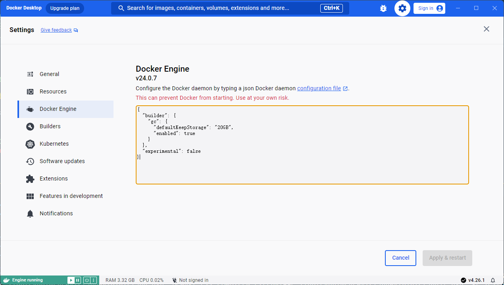
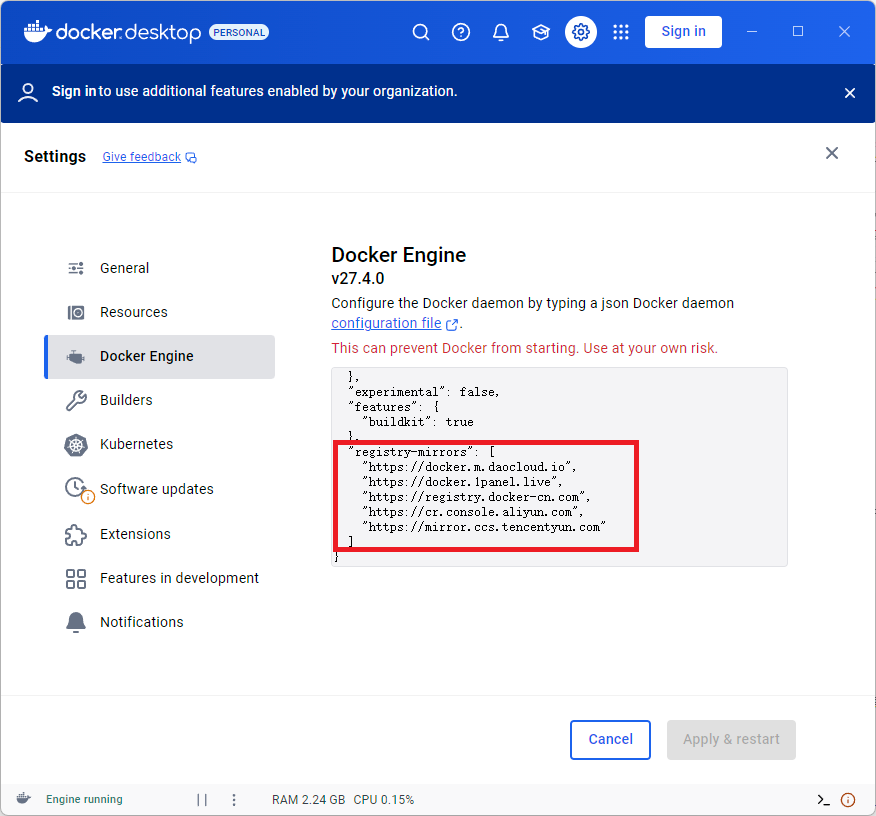

# 环境构建

强烈推荐在Windows 10或11上构建WSL2 + Ubuntu 22.04的开发与运行环境。

如使用的PC或笔记本是Linux系统，则不用安装WSL和容器，直接安装相关软件即可。

如使用的是Mac系统，建议用Docker Desktop + Ubuntu 22.04容器。

**如果WSL和容器部署都不可行，请使用VMware或VirtualBox安装Ubuntu 22.04 Server虚拟机的方式。**

**WSL、容器或虚拟机任何一种就可以，但在Windows系统上推荐用WSL安装，Mac系统推荐Docker Desktop，**

**Linux系统直接使用即可。**

## WSL2+Ubuntu 22.04

### 安装Windows Terminal

建议从Microsoft Store中下载安装Windows Terminal。

### 安装WSL

以管理员身份运行Windows Terminal后，运行下面命令：

```shell
dism.exe /online /enable-feature /featurename:Microsoft-Windows-Subsystem-Linux /all /norestart
dism.exe /online /enable-feature /featurename:VirtualMachinePlatform /all /norestart
```

运行完成之后，请重启电脑完成安装。

## 配置WSL为2.0

运行Windows Terminal后，运行下面命令：

```shell
wsl --set-default-version 2
```

### 安装Ubuntu 22.04

运行Windows Terminal后，运行下面命令安装Ubuntu-22.04：

```shell
wsl --install --distribution Ubuntu-22.04
```

在下载安装完后会提示创建一个普通用户。

这里为后续实验的方便，请设置用户名为code，密码根据自己情况设置。

最后会自动登录Ubuntu 22.04，请输入exit后退出Ubuntu，但是虚拟机仍在运行。

**注意事项**

如果出现网络限制等原因不能直接下载安装，请用PowerShell命令命令直接下载然后双击运行即可：

```power
Invoke-WebRequest -Uri https://aka.ms/wslubuntu2204 -OutFile Ubuntu-2204.appx -UseBasicParsing
Add-AppxPackage .\Ubuntu-2204.appx
```

当然也可以借助其它下载工具加速下载，下载网址：https://aka.ms/wslubuntu2204，下载后的文件名类似为Ubuntu2204-221101.AppxBundle。

### 以root用户进入Ubuntu并安装软件

在Windows Terminal中执行下面的命令以root用户进入ubuntu系统

```shell
wsl --user root --distribution Ubuntu-22.04 --cd ~
```

在进入系统后，执行下面的命令后先下载ubuntu.sh脚本，然后进行软件的安装。

请注意如创建的不是普通用户名不是code，需要修改/tmp/ubuntu.sh中的USER_NAME变量的值。

```shell
cd ~
wget -O /tmp/ubuntu.sh https://scoop.201704.xyz/https://raw.githubusercontent.com/NPUCompiler/exp01-envsetup/refs/heads/main/tools/ubuntu.sh
sh /tmp/ubuntu.sh
```

### 以普通用户code进入ubuntu进行开发与测试

在Windows Terminal 中执行下面的命令以code用户进入ubuntu系统。

``` powershell
wsl --user code --distribution Ubuntu-22.04 --cd ~
```

## Docker Desktop + Ubuntu

### 容器环境的建立

Windows系统下的下载网址为：

<https://docs.docker.com/desktop/setup/install/windows-install/>

Mac系统下的下载网址：

https://docs.docker.com/desktop/setup/install/mac-install/

Linux系统建议安装docker-ce和docker-compose，请自行查询相关资料进行安装。

请根据mac系统的CPU选择合适的软件下载，新版的mac一般为ARM CPU，请选择arm64下的Docker.dmg，老版的mac一般为Intel CPU，请选择amd64下的Docker.dmg。

## Docker Desktop的配置

打开Docker Desktop设置 > Docker Engine。

默认情况下配置如图所示：



增加registry-mirrors键值，如有buildkit则修改buildkit的值为false，然后点击"Apply & restart"。

具体的信息如下所示：

```yaml
{
  "builder": {
    "gc": {
      "defaultKeepStorage": "20GB",
      "enabled": true
    }
  },
  "experimental": false,
  "features": {
    "buildkit": false
  },
  "registry-mirrors": [
    "https://registry.docker-cn.com",
    "https://cr.console.aliyun.com",
    "https://mirror.ccs.tencentyun.com",
    "https://docker.m.daocloud.io",
    "https://docker.1panel.live",
  ]
}
```



由于网络的限制，可能不能直接从Docker的官方网站上下载容器，请通过代理解决。

## 安装Git和TortoiseGit工具

下载Git for Windows工具，从中找取最新版下载，如v2.48.1版，然后安装。其下载地址：

<https://registry.npmmirror.com/binary.html?path=git-for-windows/>
<https://github.com/git-for-windows/git/releases>

下载TortoiseGit工具，并安装。下载地址：

<https://tortoisegit.org/download/>

版本2.17.0.0的下载地址

<https://scoop.201704.xyz/https://download.tortoisegit.org/tgit/2.17.0.0/TortoiseGit-2.17.0.2-64bit.msi>

补充说明：

TortoiseGit是一款专为Windows系统设计的Git版本控制客户端工具，它为用户提供了直观、友好的图形界面，使得Git的操作更加容易理解和使用。
无论是初学者还是有经验的开发人员，都可以借助TortoiseGit提高工作效率，更好地管理和维护代码库。

重启后，鼠标右键的菜单就会有git相关操作的菜单或者界面。

注意：若不能下载，则删除网址的前缀：<https://scoop.201704.xyz/>，该网址为代理，加速下载。

## 下载Ubuntu镜像并配置环境

通过Git的命令行或者TortoiseGit克隆本实验的git。

在命令行界面进入克隆的tools目录下，然后执行如下的命令：

```shell
docker build -t ubuntu2204-dev .
```

在该镜像中会创建一个普通用户code，其密码为password，供开发时使用。

请注意：

1. **目前为Dockerfile不自动安装texlive，需要时执行查看Dockerfile中的注释进行开启。**
2. 如果开启了github加速或者代理，请删除Dockerfile文件中的https://scoop.201704.xyz/。

## 创建容器并运行Ubuntu容器

```shell
docker run -id --restart unless-stopped --name ubuntu-compile --hostname ubuntu-compile ubuntu2204-dev
```

## VSCode联动

若在打开本项目时推荐的插件已安装则不需要再次安装Dev Containers插件后，否则请安装。

在通过vscode连接容器时，请务必要事先打开Docker Desktop并运行容器ubuntu2204-dev。

可以连接到容器上进行软件开发。

## 容器的其它命令，需要时查询

## 进入Ubuntu容器查看

```shell
docker exec -it ubuntu-compile /bin/zsh
```

### 停止Ubuntu容器

```shell
docker stop ubuntu-compile
```

### 启动Ubuntu容器

```shell
docker start ubuntu-compile
```

### 重启Ubuntu容器

也就是先停止后启动容器

```shell
docker restart ubuntu-compile
```

### 删除镜像

```shell
docker rmi ubuntu2204-dev
```

## vscode 下载安装与运行

请从官网下载 vscode 并安装，下载网址：<https://code.visualstudio.com/Download>

## 克隆实验三与Vscode插件安装、配置

在命令行窗口或者资源窗口上右键克隆minic基本版的代码，主要是为了vscode上安装插件。

```shell
git clone https://scoop.201704.xyz/https://github.com/NPUCompiler/exp03-minic-basic.git
```

https://scoop.201704.xyz/为加速下载github的代理，如有问题，可删除后利用加速器或代理进行克隆。

打开vscode后选择File -> Open Folder选择克隆代码所在的文件夹进行打开，不一会儿vscode会提示安装推荐的插件，选择安装即可。

vscode根据文件.vscode/extensions.json文件进行推荐插件安装。

vscode会采用文件.vscode/settings.json进行vscode的配置，这称为workspace的配置，优先vscode的用户配置。

## dotnet安装与vscode配置

为了使VScode与cmake联动更加有效，需要下载安装dotnet-sdk 6.0。下载网址：
<https://dotnet.microsoft.com/zh-cn/download/dotnet/6.0>

确保修改.vscode/settings.json中的cmake.languageSupport.dotnetPath值为C:/Program Files/dotnet/dotnet.exe

## VSCode与WSL2联动

用 vscode + wsl 方式连接开发。确保修改.vscode/settings.json中的cmake.languageSupport.dotnetPath值为/usr/bin/dotnet

## VSCode与SSH联动

用 vscode + ssh 方式连接开发。确保修改.vscode/settings.json中的cmake.languageSupport.dotnetPath值为/usr/bin/dotnet

## VSCode与容器联动

用vscode + container方式连接开发。确保修改.vscode/settings.json中的cmake.languageSupport.dotnetPath值为/usr/bin/dotnet

## 安装优秀的字体

请进入fonts目录下安装FiraCode、JetBrainsMono和MonoLisa的字体。Windows系统下安装非常简单，直接双击文件选择安装即可。
